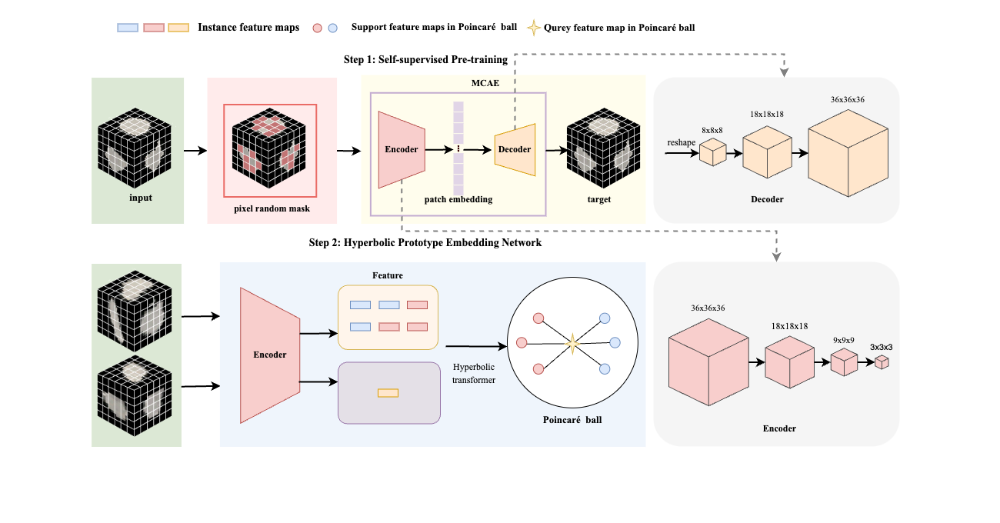
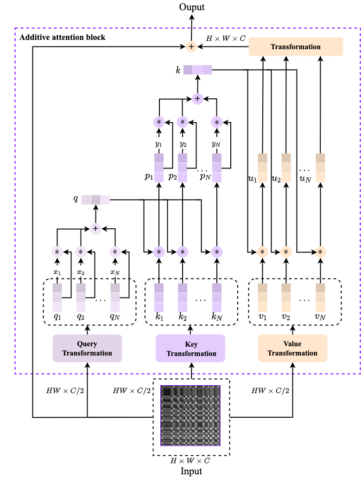
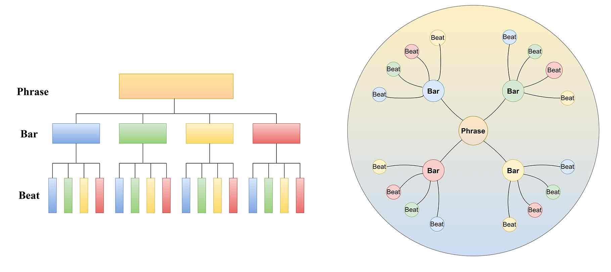
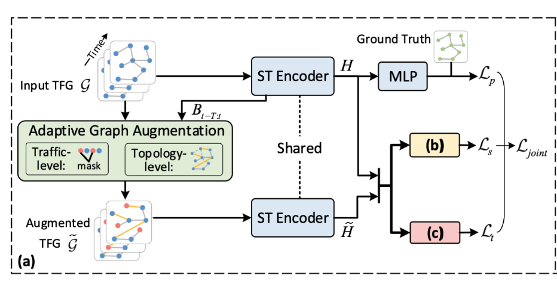
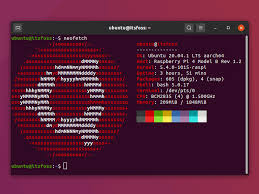








I have graduated with a Bachelor’s degree in Robotics Engineering from [Guangzhou University](https://www.gzhu.edu.cn/). I worked on "AI for Social Good" and my research interest includes：
-  **Hyperbolic Theory**
-  **AI for Healthcare**
-  **Medical Image Processing**
-  **Computer Vision**
-  **Natural Language Processing**

I am very fortunate to be advised by [Prof. Huang](https://jd.gzhu.edu.cn/info/1150/3954.htm) from Guangzhou University.

You can find my CV here:[Haizhou Xu’s Curriculum Vitae](../files/CV.pdf).

# 🔥 News
- *2024.06*: &nbsp;🎉🎉 ‘Occult lymph node metastasis prediction in non-small cell lung cancer based self-supervised pretrained and hyperbolic theory’ have been accepted by **Applied Soft Computing**. [Link](https://www.sciencedirect.com/science/article/abs/pii/S1568494624007233) (Top Journal Q1 IF=7.2)
- *2023.10*: &nbsp;🎉🎉 I received a first prize scholarship.
- *2023.05*: &nbsp;🎉🎉 ‘MRP-Net: Seizure detection method based on modified recurrence plot and additive attention convolution neural network’ have been accepted by **Biomedical Signal Processing and Control**. [Link](https://www.sciencedirect.com/science/article/abs/pii/S1746809423005980) (First Student Author) (Q1 IF=4.9)
- *2023.03*: &nbsp;🎉🎉 ‘Hyperbolic Music Transformer for Structured Music Generation’ have been accepted by **IEEE Access**. [Link](https://ieeexplore.ieee.org/document/10070602) (Q2 IF=3.4)

# 📝 Publications

- Occult lymph node metastasis prediction in non-small cell lung cancer based self-supervised pretrained and hyperbolic theory  
**Haizhou Xu**, Jiaqi Wu, Yujia Yu, Wenkai Huang†, Jiong Ni†  
*Applied Soft Computing* | [paper](../files/paper3.pdf)

<!-- 

  

  
new
  

    
  

  

    -->
  

new

  **Abstract:** Predicting occult lymph node metastasis in non-small cell lung cancer (NSCLC) patients is pivotal for tailoring appropriate surgical and therapeutic interventions. This prognostic factor remains underexplored, largely due to the intricate variability of occult lymph node characteristics and the absence of a pathologically confirmed predictive dataset. Addressing this gap, we retrospectively assembled a dataset of occult lymph node metastases (TJ-OLNM) from NSCLC patients who underwent chest Computed Tomography (CT) scans at Tongji Hospital, Tongji University from 2016 to 2021. Utilizing this dataset, we developed a novel self-supervised learning model, the Occult Lymph Node Metastasis Network (OLNM-Net), which leverages hyperbolic metric few-shot learning to enhance the prediction accuracy of occult metastases. Our comprehensive evaluations demonstrate that OLNM-Net significantly outperforms existing models in predicting occult lymph node metastasis, offering new insights into the preoperative assessment of NSCLC and advancing the application of machine learning in medical diagnostics.

- MRP-Net: Seizure detection method based on modified recurrence plot and additive attention convolution neural network  
Wenkai Huang†, **Haizhou Xu**, Yujia Yu  
*Biomedical Signal Processing and Control* | [paper](../files/paper2.pdf)

new

**Abstract:** Electroencephalographic (EEG) signals play an important role in the detection of seizures in epilepsy, and accurate detection of seizures can buy patients valuable treatment time. However, most seizure detection methods ignore the nonlinear, implicit characteristics of EEG, which has some impact on the accuracy of detection. Therefore, in this paper, we propose an EEG epilepsy detection network (MRP-Net) based on modified recurrence plot (MRP) and additive attention convolution neural network. This network can fully take into account the nonlinear, occult characteristics of EEG which can be mapped to the two-dimensional plane and served as the input of additive attention convolution neural network to automatically learn, analyze, and extract the EEG characteristics of seizures. The performance of the proposed method was evaluated on the Bonn University dataset and the SWEC-ETHZ short-term dataset. Sensitivity, specificity and accuracy were 100\% in multiple detection tasks in the University of Bonn single-channel EEG dataset. The sensitivity, specificity and accuracy of SWEC's short-term, multi-channel EEG dataset were 99.77\%, 99.57\% and 99.69\%, respectively, higher than the latest methods (3.76\%, 4.73\% and 4.27\%). The results of the experiments show that the network in this paper is superior and universal in epilepsy detection.

- Hyperbolic Music Transformer for Structured Music Generation  
Wenkai Huang, Yujia Yu, **Haizhou Xu**, Zhiwen Su, Yu Wu†  
*IEEE Access* | [paper](../files/paper1.pdf)

new

**Abstract:** In the field of music generation, generating structured music is a highly challenging research topic. Music generation methods are currently learned in Euclidean space and usually modeled as a time series without structural properties, but due to the limitations of the time series representation in Euclidean space, the hierarchical structure of music is difficult to learn, and the generated music is poorly structured. Therefore, based on hyperbolic theory, this paper proposes a Hyperbolic Music Transformer model, which considers the hierarchy in music and models the structured components of music in hyperbolic space. Meanwhile, in order for the network to have sufficient capacity to learn music data with hierarchical and power regular structure, a hyperbolic attention mechanism is proposed, which is an extension of the attention mechanism in hyperbolic space based on the definition of hyperboloid and Klein model. Subjective and objective experiments show that the model proposed in this paper is able to generate high-quality music with structure.

<!-- # 💻 Projects -->
# 💻 Blog

<!-- 

  

    
  

  

    <h3>Depth Pro: Sharp Monocular Metric Depth in Less Than a Second</h3>
    

      apple/ml-depth-pro
      • PyTorch
      • 2 Oct 2024
    

    
We present a foundation model for zero-shot metric monocular depth estimation.

    

      Monocular Depth Estimation
      Test
    

  

  

    

      ⭐ 2,730
    

    3.06 stars/hour

    

      <a href="#" class="paper">Paper</a>
      <a href="#" class="code">Code</a>
    

  

 
  -->

<!-- 第一篇博客 -->

  

    
  

  

    <h3>ST-SSL paper and code notes</h3>
    

      • Traffic prediction
      • 10 Oct 2024
    

    
This blog provides an overview of ST-SSL (Spatial-Temporal Self-Supervised Learning), a framework designed for learning from spatial-temporal graph data. It introduces the key components of ST-SSL, including adaptive graph augmentation, spatial-temporal encoding, and self-supervised learning techniques. 

    

      Paper notes
      Deep Learning
      GNN
      Mathematical Derivation
    

  

  

    

      🔍 0 views <!-- 修改ID -->
    

    

      <a href="../files/Blog/ST-SSL/ST-SSL.html" class="paper" onclick="updateViewCount('blog-004', 'totalViews4')">Link</a> <!-- 修改onclick函数 -->
    

  

 
 

<!-- 第二篇博客 -->

  

    
  

  

    <h3>DDPM Formula Derivation</h3>
    

      • Diffusion Models
      • 8 Dec 2023
    

    
This blog offers a detailed derivation of Denoising Diffusion Probabilistic Model (DDPM) formulas, explaining key concepts like forward/reverse diffusion and noise scheduling. It helps readers understand DDPM’s core equations and its application in generative modeling.

    

      Generative Models
      Deep Learning
      Mathematical Derivation
    

  

  

    

      🔍 0 views <!-- 修改ID -->
    

    

      <a href="../files/Blog/DDPM%20Formula%20Derivation/DDPM%20Formula%20Derivation.html" class="paper" onclick="updateViewCount('blog-003', 'totalViews3')">Link</a> <!-- 修改onclick函数 -->
    

  

 
 

<!-- 第三篇博客 -->

  

    
  

  

    <h3>4090x2 Linux Deep Learning Server Configuration Tutorial</h3>
    

      • GPU Server Configuration
      • 15 Jan 2023
    

    
This blog is a tutorial on configuring an Ubuntu 4090 deep learning server, detailing steps for installing drivers, software, and frameworks. It helps users optimize their server for efficient deep learning performance with the 4090 GPU.

    

      Ubuntu
      Linux Configuration
      Deep Learning
    

  

  

    

      🔍 0 views <!-- 修改ID -->
    

    

      <a href="../files/Blog/Ubuntu/Ubuntu.html" class="paper" onclick="updateViewCount('blog-002', 'totalViews2')">Link</a> <!-- 修改onclick函数 -->
    

  

 
 

<!-- 第四篇博客 -->

  

    
  

  

    <h3>Notion Mathematical Formula</h3>
    

      • Notion
      • 1 Jun 2022
    

    
The blog provides detailed instructions on using KaTeX to write mathematical formulas in Notion, covering expressions like fractions, roots, matrices, subscripts, and superscripts. It explains how to insert and display these formulas effectively, with code examples and results for easy reference and application.

    

      KaTeX
      Markdown
    

  

  

    

      🔍 0 views <!-- 修改ID -->
    

    

      <a href="../files/Blog/Notion%20mathematical%20formula/notion%20mathematical%20formula.html" class="paper" onclick="updateViewCount('blog-001', 'totalViews1')">Link</a> <!-- 修改onclick函数 -->
    

  

 
 

<!-- JavaScript -->

# 🎖 Honors and Awards

- *2023.10* The First Prize Scholarship. (TOP 5%)

# 📖 Educations

- *2020.09 - 2024.06* Robot Engineering(BE), Guangzhou University. 

# 🦄 Welcome to my website
<body>

</body>
