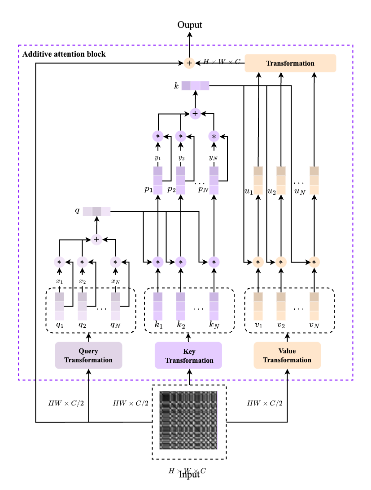








I’m a senior student majoring in Robotics Engineering at [Guangzhou University](https://www.gzhu.edu.cn/). My research interest includes：
-  **AI for Healthy**
-  **Medical Image Processing**
-  **Computer Vision**
-  **Machine Learning**

I am very fortunate to be advised by [Prof. Huang](https://jd.gzhu.edu.cn/info/1150/3954.htm) from Guangzhou University.

You can find my CV here:[ Haizhou Xu’s Curriculum Vitae](../files/CV.pdf).

# 🔥 News

- *2023.10*: &nbsp;🎉🎉 I received a first prize scholarship.
- *2023.05*: &nbsp;🎉🎉 ‘MRP-Net: Seizure detection method based on modified recurrence plot and additive attention convolution neural network’ have been accepted by Biomedical Signal Processing and Control.
- *2023.03*: &nbsp;🎉🎉 ‘Hyperbolic Music Transformer for Structured Music Generation’ have been accepted by IEEE Access.

# 📝 Publications 

new

- [Hyperbolic Music Transformer for Structured Music Generation](https://ieeexplore.ieee.org/document/10070602?denied=)
- Wenkai Huang,**Yujia Yu**, Haizhou Xu, **IEEE Access**
- This paper proposes a Hyperbolic Music Transformer model, which considers the hierarchy in music and models the structured components of music in hyperbolic space. Meanwhile, in order for the network to have sufficient capacity to learn music data with hierarchical and power regular structure, a hyperbolic attention mechanism is proposed, which is an extension of the attention mechanism in hyperbolic space based on the definition of hyperboloid and Klein model. 

new

- [Self-Supervised Hyperbolic Metric Few-Shot Learning for Occult Lymph Node Metastasis Prediction in NSCLC](https://www.sciencedirect.com/science/article/pii/S1746809423005980)
- **Haizhou Xu**, Jiaqi Wu, Yujia Yu, Wenkai Huang, Jiong Ni, **IEEE TRANSACTIONS ON MEDICAL IMAGING(under review)**
- This paper proposes a Hyperbolic Music Transformer model, which considers the hierarchy in music and models the structured components of music in hyperbolic space. Meanwhile, in order for the network to have sufficient capacity to learn music data with hierarchical and power regular structure, a hyperbolic attention mechanism is proposed, which is an extension of the attention mechanism in hyperbolic space based on the definition of hyperboloid and Klein model. 

  

new

- [MRP-Net: Seizure detection method based on modified recurrence plot and additive attention convolution neural network](https://www.sciencedirect.com/science/article/pii/S1746809423005980)
- Wenkai Huang, **Haizhou Xu**, Yujia Yu, **Biomedical Signal Processing and Control**
- This paper proposes a Hyperbolic Music Transformer model, which considers the hierarchy in music and models the structured components of music in hyperbolic space. Meanwhile, in order for the network to have sufficient capacity to learn music data with hierarchical and power regular structure, a hyperbolic attention mechanism is proposed, which is an extension of the attention mechanism in hyperbolic space based on the definition of hyperboloid and Klein model. 

new

- [Hyperbolic Music Transformer for Structured Music Generation](https://ieeexplore.ieee.org/document/10070602?denied=)
- Wenkai Huang, Yujia Yu, **Haizhou Xu**, **IEEE Access**
- This paper proposes a Hyperbolic Music Transformer model, which considers the hierarchy in music and models the structured components of music in hyperbolic space. Meanwhile, in order for the network to have sufficient capacity to learn music data with hierarchical and power regular structure, a hyperbolic attention mechanism is proposed, which is an extension of the attention mechanism in hyperbolic space based on the definition of hyperboloid and Klein model. 

# 💻 Projects

# 🎖 Honors and Awards

- *2023.10* The First Prize Scholarship.

# 📖 Educations

- *2020.09 - 2023.10 (now)*, Robot Engineering(BE), Guangzhou University. 

